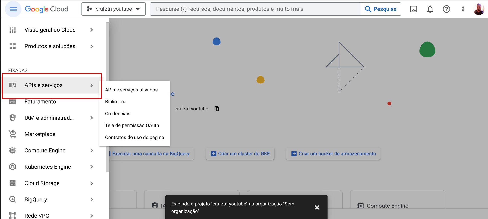
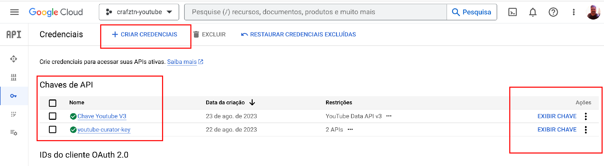

# Video Curator Application

## Index
- [Getting Started](#EntendendoAAplicacao)
- [Tutorial - Obtendo a Chave de API do Youtube](#ObtendoAChaveDeApiDoYoutube)
- [Tutorial - Fazendo o build com Docker](#FazendoOBuildComDocker)
- [Tutorial - Fazendo deploy localmente](#FazendoDeployLocalmente)

## Documentação auxiliar
> - [Swagger (projeto rodando)](http://localhost:9999/swagger-ui/indexhtml)
> - [Repositório Github](https://github.com/ovnny2/design-patterns)

> - [YouTube API Docs](https://developers.google.com/youtube/v3/getting-started)
> - [Google Cloud Console](https://console.cloud.google.com/)

## Entendendo a aplicação
Video Curator é uma feature de um projeto maior que iniciei meses atrás estudando arquitetura de microsserviços.
Essa feature em particular será somente uma PoC (Prova de Conceito) para experiência no uso de LLM (Large Language Models)
e PNL (Processamento de linguagem Natural) como o [ChatGPT da Microsoft](https://chat.openai.com/auth/login) e o 
[Llama do Facebook](https://github.com/ggerganov/llama.cpp). Além da pesquisa e uso de modelos mais
leves e open source como alguns LLM's listados no repositório público [Huggin Face](https://huggingface.co/).

O projeto visa também os primeiros contatos com bancos de dados vetoriais.

### Definição:
> "Uma aplicação web que faz a curadoria de videos e mídia no Youtube utilizando Inteligência Artificial, Machine Learning
> e Processamento de Linguagem Natural visando auxiliar o usuário na diminuição da curva de aprendizado. 
> A aplicação vai ser interativa podendo gerar resumos, nuvens de palavras de determinados videos e até criar questionários
>sobre o assunto do video.

### Considerações:
> A aplicação é uma prova de conceito, não tem a intenção de representar as complexidades de um sistema em produção. 
Contudo, sempre seguirá os preceitos e boas práticas do desenvolvimento de software levando em conta os trade offs 
que cada decisão tomada tem e como desenvolver estratégias de gestão (de tempo e de recursos).

### Diagrama

## Tutorial - Obtendo a chave de API do Youtube

A aplicação tenta seguir os preceitos do [Twelve Factor App](https://12factor.net/) procurando manter-se stateless o máximo
que o contexto dessa atividade permite, sendo assim, você será capaz de rodar essa aplicação em qualquer ambiente de 
desenvolvimento (Linux, Windows ou MAC). 
Ágil e Domain Driven Design também serão considerados durante o desenvolvimento.

A única exceção será a chave de API do Youtube, que é informação sensível e nunca deve ser exposta num repositório público
como o Github.

### Obtendo a chave de API
- Vá ao [Google Cloud Console](https://console.cloud.google.com/), faça login na sua conta google e crie um projeto.   
> O cadastro e obtenção da chave de API são gratuitos para uso pessoal. Somente é preciso definir métodos de pagamento 
> para uso comercial

- Ao criar o projeto, você verá uma tela como essa. No meu caso, eu criei um projeto chamado craftzn-youtube.

- No Menu esquerdo você vai encontrar o item API e Serviços.

- Clique na parte de Credenciais. Aqui você vai gerar a sua chave de API para que você possa usá-la nas suas futuras
chamadas HTTP para a API do Youtube.

- Clicando na sua chave recém criada, você poderá fazer modificações de autorização, ou seja, criar uma camada de proteção
caso seus dados vazem de algum modo. Aqui você pode definir somente certos IPs de onde as requisições poderão ser 
feitas, por exemplo. É possível limitar o acesso a somente certas APIs para evitar que agentes maliciosos usem nossa chave
privada para atividades ilícitas.

> No nosso caso, iremos usar a [Youtube Data API v3](https://developers.google.com/youtube/v3/getting-started)

- Agora que adicionamos uma camada de segurança a nossa chave só precisamos copiá-la em algum lugar seguro fora do nosso 
projeto.

## Tutorial - Fazendo o Build com Docker

### Buildando Imagens Docker
Agora que temos a chave de acesso à API do Youtube, a Youtube Data API V3, conseguiremos fazer o build do projeto. 
Acompanhando o os princípios do Twelve Factor App, iremos trabalhar com containers. Especificamente com Docker Container.

- Vá para a pasta root do projeto em ``design-patterns``
- Caso tenha o Docker e Docker Compose já instalados, digite no terminal

        docker build -t video-curator ./videocurator/.; \
        docker build -t youtube-mongodb -f ./videocurator/support/mongo/Dockerfile_youtubedb ./videocurator/.       

Caso não tenha... 
- [vá na documentação e instale o Docker](https://docs.docker.com/engine/install/)
- [E o Docker Compose](https://docs.docker.com/compose/install/)

### Deploy com Docker Compose
Em caso do passo anterior for completado com sucesso, você poderá dar o comando ``docker images ls`` e verificar as duas 
imagens do projeto.

        REPOSITORY        TAG       IMAGE ID       CREATED       SIZE
        video-curator     latest    1881d3df4ac8   5 hours ago   361MB
        youtube-mongodb   latest    59203bd63071   3 days ago    669MB

## Tutorial - Rodando a aplicação localmente

### Docker Compose Up
Agora que temos nossas imagens Docker e nossa chave de API, vamos fazer o deploy no ambiente local. 
Vá até onde o arquivo docker-compose.yml está e digite no terminal:

        docker-compose up -d --remove-orphans

Pra verificar se seus containeres estão de pé, basta digitar no terminal:

        docker ps
Você deve observar informações como essas abaixo:

        CONTAINER ID   IMAGE             COMMAND                  CREATED         STATUS         PORTS                                           NAME        
        8463524fe025   video-curator     "java -jar /app/app.…"   6 seconds ago   Up 5 seconds   0.0.0.0:9999->9999/tcp, :::9999->9999/tcp       video-curato
        946021b9f5c1   youtube-mongodb   "docker-entrypoint.s…"   6 seconds ago   Up 5 seconds   0.0.0.0:32771->27017/tcp, :::32771->27017/tcp   youtube-mongod

### Observando o estado das nossas aplicações

Por enquanto, só video-curator (Aplicação Spring) e youtube-mongodb (NoSQL Database Movido a Documentos Super estruturados).
Para observar o estado das suas aplicações rodando em conteineres, vá ao terminal e digite:

        docker ps
        docker ps -a
        docker logs <nome-do-container> --follow
        docker-compose logs

Caso você deseje ver os logs da aplicação Spring, digite:

        docker logs videocurator --follow

Você deve ver algo parecido com:
